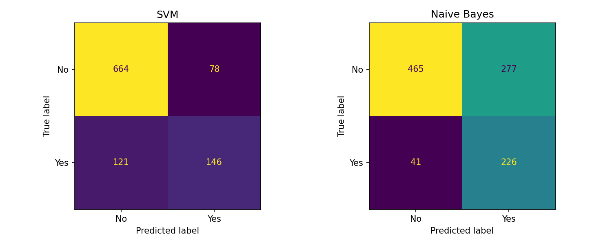
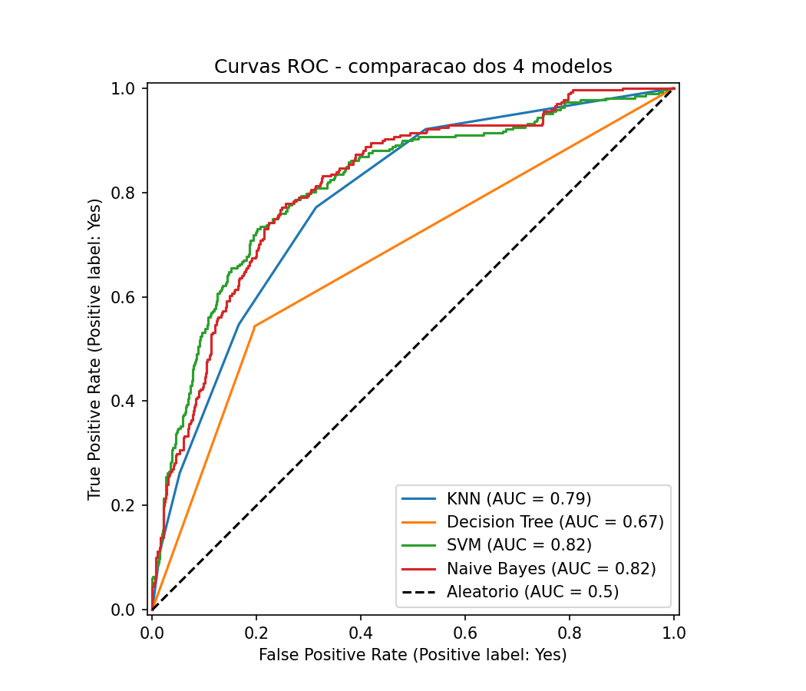

# 📊 Customer Churn Prediction

> End-to-end customer churn prediction for a telecom operator using CRISP-DM, exploratory data analysis, preprocessing and supervised machine learning models.


## 📑 Table of Contents

- [Overview](#overview)
- [Business Problem](#business-problem)
- [Dataset](#dataset)
- [CRISP-DM Methodology](#crisp-dm-methodology)
- [Repository Structure](#repository-structure)
- [Technologies](#technologies)
- [Installation and Execution](#installation-and-execution)
- [Results and Model Evaluation](#results-and-model-evaluation)
- [Main Insights](#main-insights)
- [Limitations and Next Steps](#limitations-and-next-steps)
- [Author](#author)
- [License](#license)

## Overview

This project predicts customer loss, also known as **customer churn**, in a telecommunications company. It follows the **CRISP-DM** methodology, going through the stages of problem understanding, exploratory data analysis, data preparation, modeling, and evaluation of the results.

The work started as part of the **Data Mining** course unit, in the Post-Graduation in Big Data and Decision Making at ISEP, and was developed into a complete, reproducible portfolio project, with a focus on documentation and comparison of classification models.

## Business Problem

Customer retention is an important challenge for telecommunications companies, because keeping an existing customer is usually cheaper than acquiring a new customer.

The goal of this project is to identify, based on contract data and service usage data, which customers have a higher probability of canceling the service. This prediction can support preventive retention actions, such as targeted campaigns, plan reviews, personalized offers, or proactive contact with customers at risk.

In this type of problem, the **recall** metric is especially important, because failing to identify a customer who is about to leave can represent a direct loss of revenue.

## Dataset

The project uses the public **Telco Customer Churn** dataset, frequently used in classification and churn prediction studies. The data source is documented in `data/raw/SOURCE.md`.

Main groups of variables present in the dataset:

| Group | Examples of Variables | Description |
|---|---|---|
| Demographic data | gender, SeniorCitizen, Partner, Dependents | General information about the customer |
| Contracted services | PhoneService, InternetService, OnlineSecurity, TechSupport | Services used by the customer |
| Contract information | Contract, PaperlessBilling, PaymentMethod | Type of contract and payment method |
| Financial values | MonthlyCharges, TotalCharges | Monthly and total costs |
| Target variable | Churn | Indicates whether the customer canceled the service or not |

A relevant data-quality note: the dataset was assembled from **two sources with different encodings** (`Yes/No` vs `True/False` vs `0/1`, and `"No internet service"` vs missing values). These inconsistencies were detected during the project and unified in the preparation phase — see [Main Insights](#main-insights).

Possible limitations of the dataset:

- The data represents a specific telecommunications scenario.
- The dataset is public and may not reflect all variables used by real companies.
- Some variables may contain biases related to the customer profile or the data collection period.
- The project has an educational and portfolio purpose, and is not a production-ready model.

## CRISP-DM Methodology

1. **Business Understanding**  
   Definition of the business problem, the model objective, and the relevance of churn prediction for retention actions.

2. **Data Understanding** (`notebooks/01_data_understanding.ipynb`)  
   Initial analysis of the dataset: data types, missing values, target variable distribution, descriptive statistics, and exploratory data analysis.

3. **Data Preparation** (`notebooks/02_data_preparation.ipynb`)  
   Data cleaning, unification of mixed encodings from the merged sources, treatment of structural missing values (customers without a given service), conversion of `TotalCharges` to numeric, and export of the clean dataset to `data/processed/`.

4. **Modeling** (`notebooks/03_modeling.ipynb`)  
   One-hot encoding, stratified 80/20 train-test split, feature scaling with `StandardScaler`, and training of four classifiers:

   - K-Nearest Neighbors
   - Decision Tree
   - Support Vector Machine
   - Gaussian Naive Bayes

5. **Evaluation** (`notebooks/03_modeling.ipynb`)  
   Accuracy, precision, recall, F1-score, confusion matrices, ROC curves, and 5-fold cross-validation.

6. **Deployment**  
   Not included in this phase. As next steps, the model may be organized into a reusable pipeline and later exposed through an API or analytical dashboard.

## Repository Structure

```text
data-mining-churn-prediction/

├── data/
│   ├── raw/              # raw data and source documentation
│   └── processed/        # cleaned and prepared data
│
├── notebooks/
│   ├── 01_data_understanding.ipynb
│   ├── 02_data_preparation.ipynb
│   └── 03_modeling.ipynb
│
├── reports/
│   ├── figures/          # exported charts and visualizations
│   └── model_comparison.csv
│
├── WORKLOG.md            # session-by-session work log
├── requirements.txt
├── .gitignore
├── LICENSE
└── README.md
```

## Technologies

| Layer | Technology |
|---|---|
| Language | Python 3.11 |
| Data manipulation | Pandas, NumPy |
| Modeling | scikit-learn |
| Visualization | Matplotlib, Seaborn |
| Environment | Jupyter Notebook |
| Version control | Git, GitHub |
| Methodology | CRISP-DM |

## Installation and Execution

```bash
git clone https://github.com/aavelarbelo/data-mining-churn-prediction.git
cd data-mining-churn-prediction

python -m venv .venv
.venv\Scripts\activate

pip install -r requirements.txt
jupyter notebook
```

On Linux or macOS, the virtual environment can be activated with:

```bash
source .venv/bin/activate
```

Run the notebooks in order (01 → 02 → 03) to reproduce the full pipeline.

## Results and Model Evaluation

All models were trained on an 80/20 stratified split (5,042 customers, 46 features after one-hot encoding) with `StandardScaler` applied. Results on the held-out test set (1,009 customers), with "Yes" (churn) as the positive class:

| Model | Accuracy | Precision | Recall | F1 | ROC AUC |
|---|---:|---:|---:|---:|---:|
| KNN (k=5) | 0.758 | 0.543 | 0.547 | 0.545 | 0.79 |
| Decision Tree | 0.734 | 0.498 | 0.539 | 0.518 | 0.67 |
| **SVM** | **0.803** | **0.652** | 0.547 | **0.595** | **0.82** |
| **Naive Bayes** | 0.685 | 0.449 | **0.846** | 0.587 | **0.82** |

5-fold cross-validation (F1 of the positive class) confirmed the stability of these results: all standard deviations were below 0.03, with Naive Bayes reaching the best mean F1 (0.597 ± 0.016) and SVM the most stable performance (0.571 ± 0.006).





Scaling proved decisive: without `StandardScaler`, the SVM collapsed to predicting only the majority class (recall = 0.000). The full comparison table is available in `reports/model_comparison.csv`.

## Main Insights

- **Accuracy is misleading on imbalanced data.** A naive model predicting "no churn" for everyone would score 0.735 accuracy. KNN's 0.758 looks decent but only catches about half of the actual churners.
- **There is no single best model — it depends on the cost of errors.** Naive Bayes catches 85% of churners (only 41 out of 267 missed) at the cost of many false alarms (277). SVM offers the best overall balance (F1 0.595, AUC 0.82) with far fewer false alarms (78), but misses 121 churners. If a retention action is cheap (e.g., an email), Naive Bayes maximizes saved customers; if it is expensive (e.g., an aggressive discount), SVM is the better choice.
- **Feature scaling can make or break a model.** SVM went from completely useless (recall = 0.000) to the best overall performer (accuracy 0.803) simply by standardizing the features. Tree-based models were unaffected, as expected.
- **Data quality issues hide in layers.** The merged sources used different encodings; one-hot encoding exposed the problem (77 columns instead of ~46). The fix was applied in the preparation phase and the pipeline re-run — reproducibility made the correction cheap.

## Limitations and Next Steps

Current limitations:

- The project uses a public and limited dataset.
- It does not yet include advanced hyperparameter tuning.
- It does not include model deployment.
- The analysis was conducted with an educational and portfolio focus.

Next steps:

- Hyperparameter tuning (e.g., grid search on k for KNN, C/gamma for SVM).
- Explore class-imbalance techniques (class weights, resampling).
- Refactor reusable logic into `src/` scripts.
- Evolve towards a production-style pipeline (API or analytical dashboard).

## Author

**Andressa Avelar Belo**  
Control & Automation Engineer transitioning into Data Engineering, Big Data and Analytics.

[LinkedIn](https://linkedin.com/in/andressaavelar) · [GitHub](https://github.com/aavelarbelo) · eng.belo@gmail.com

## License

This project is licensed under the MIT License — see the [LICENSE](LICENSE) file for details.
